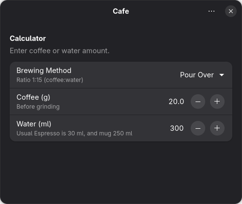

# Cafe

A simple, native GTK4 coffee beans and water ratio calculator for Linux desktop applications.


## Features

- **Multiple Brewing Methods**: Supports Espresso, Pour Over, French Press, and AeroPress
- **Bidirectional Calculation**: Enter either coffee or water amount, and the other is automatically calculated
- **Unit Systems**: Switch between Metric (grams/ml) and Imperial (ounces/fl oz) units
- **Native GTK4**: Built with [GTKx](https://github.com/eugeniodepalo/gtkx) for a native Linux desktop experience
- **Adwaita Design**: Follows GNOME Human Interface Guidelines for a modern, consistent UI

## Screenshots



## Installation

### From Flatpak (Recommended)

Install from the project's Flatpak repository, which also delivers updates:

```bash
flatpak install --user https://tduarte.github.io/cafe/cafe.flatpakref
```

To build the bundle yourself instead (needs `flatpak-builder` and the GNOME 50 SDK):

```bash
pnpm build:flatpak
```

Then install the generated bundle and run it:

```bash
flatpak install --user build/out/io.github.tduarte.cafe-1.0.0-x86_64.flatpak
flatpak run io.github.tduarte.cafe
```

See [FLATPAK.md](./FLATPAK.md) for details.

### Building from Source

#### Prerequisites

- Linux with GTK 4.20+ and Libadwaita 1.8+ (development libraries)
- Node.js 24 or later
- pnpm

#### Setup

```bash
git clone https://github.com/tduarte/cafe.git
cd cafe
pnpm install

pnpm dev        # run with fast refresh
pnpm typecheck  # regenerate bindings and type check
pnpm build      # production bundle in dist/
pnpm start      # run the production bundle
```

## Usage

1. **Select a Brewing Method**: Choose from Espresso, Pour Over, French Press, or AeroPress
2. **Enter Amount**: Type either the coffee amount or water amount
3. **View Result**: The corresponding amount is automatically calculated and displayed
4. **Change Units**: Open Preferences (Ctrl+,) to switch between Metric and Imperial units

### Supported Ratios

- **Espresso**: 1:2 (coffee:water)
- **Pour Over**: 1:15
- **French Press**: 1:12
- **AeroPress**: 1:11

## Development

### Project Structure

```
cafe/
├── src/
│   ├── app.tsx              # Application, main window, preferences and about dialogs
│   ├── index.tsx            # Entry point
│   └── utils/
│       └── calculations.ts  # Calculation logic and unit conversions
├── data/icons/              # Application icons (hicolor layout)
├── assets/                  # Screenshots and extra artwork
└── gtkx.config.ts           # App ID, icon, and packaging metadata
```

## Contributing

Contributions are welcome! Please feel free to submit a Pull Request.

1. Fork the repository
2. Create your feature branch (`git checkout -b feature/amazing-feature`)
3. Commit your changes (`git commit -m 'Add some amazing feature'`)
4. Push to the branch (`git push origin feature/amazing-feature`)
5. Open a Pull Request

## License

This project is licensed under the GNU General Public License v3.0 (GPL-3.0) - see the [LICENSE](./LICENSE) file for details.

## Acknowledgments

- Built with [GTKx](https://github.com/eugeniodepalo/gtkx) - Build native GTK4 desktop applications with React and TypeScript
- Uses [Adwaita](https://gnome.pages.gitlab.gnome.org/libadwaita/) design system for GNOME applications

## Author

**Thiago Duarte**

- GitHub: [@tduarte](https://github.com/tduarte)

